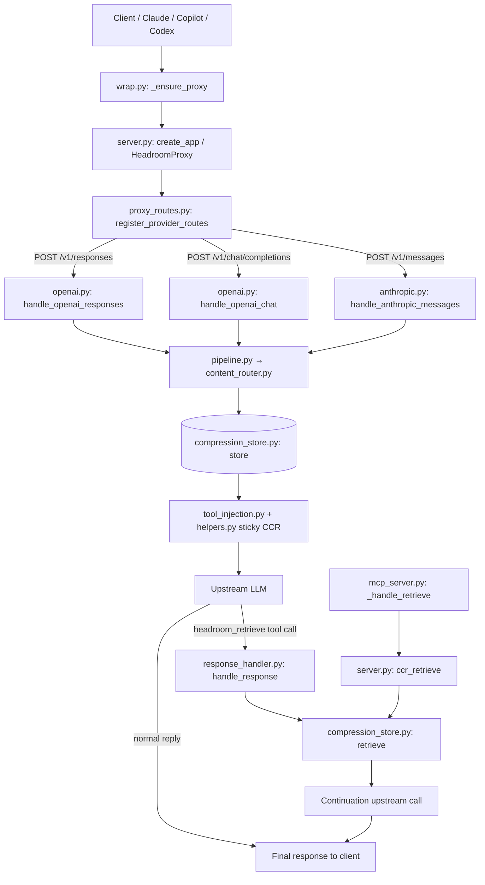

# Flow Tracer — First Message & Retrieve

End-to-end call chains with **file → function** for:

1. **First message** — client request enters Headroom, gets compressed, CCR tools injected, then forwarded upstream
2. **Retrieve** — model (or client/MCP) asks for original compressed content via `headroom_retrieve`

Use this when debugging: start at the route that matches your client, then walk the numbered steps.

---

## Mental model

| Phase | What happens |
|-------|----------------|
| **First message** | Client → wrap BASE_URL → FastAPI route → provider handler → compress + store markers → inject `headroom_retrieve` → upstream LLM → response to client |
| **Retrieve** | Upstream returns `headroom_retrieve(hash)` → `CCRResponseHandler` (or `/v1/retrieve` / MCP) → `CompressionStore.retrieve` → tool_result → continuation upstream → final answer to client |



---

## 0. Bootstrap (before the first message)

Started once when you run `headroom wrap …` or `headroom proxy`.

| # | File | Function | Role |
|---|------|----------|------|
| 1 | `headroom/cli/wrap.py` | `wrap()` | Click group entry |
| 2 | `headroom/cli/wrap.py` | `claude()` / `copilot()` / etc. | Agent-specific wrap |
| 3 | `headroom/cli/wrap.py` | `_ensure_proxy()` | Reuse or start proxy |
| 4 | `headroom/cli/wrap.py` | `_start_proxy()` | Spawns `python -m headroom.cli proxy` |
| 5 | `headroom/cli/proxy.py` | `proxy()` | Builds `ProxyConfig`, calls `run_server` |
| 6 | `headroom/proxy/server.py` | `run_server()` → `create_app()` | FastAPI app |
| 7 | `headroom/proxy/server.py` | `HeadroomProxy.__init__()` | Pipelines, CCR handler, memory |
| 8 | `headroom/providers/proxy_routes.py` | `register_provider_routes()` | HTTP route → handler wiring |

**Env after wrap**

- Claude: `ANTHROPIC_BASE_URL` (and Vertex/Foundry variants) → proxy
- Copilot / OpenAI: `OPENAI_BASE_URL` / `GITHUB_COPILOT_API_URL` → proxy
- Optional MCP: wrap → `headroom/ccr/mcp_server.py` (`HeadroomMCPServer`)

**`HeadroomProxy` mixins**

| Mixin | File |
|-------|------|
| `StreamingMixin` | `headroom/proxy/handlers/streaming.py` |
| `AnthropicHandlerMixin` | `headroom/proxy/handlers/anthropic.py` |
| `OpenAIHandlerMixin` | `headroom/proxy/handlers/openai.py` |
| `GeminiHandlerMixin` | `headroom/proxy/handlers/gemini.py` |
| `BatchHandlerMixin` | `headroom/proxy/handlers/batch.py` |
| `BedrockHandlerMixin` | `headroom/proxy/handlers/bedrock.py` |

Pipelines created in `__init__`:

- `anthropic_pipeline` / `openai_pipeline` = `TransformPipeline([ContentRouter, …])`
- `ccr_response_handler` = `CCRResponseHandler`
- `memory_handler` = `MemoryHandler` (if `--memory`)

---

## 1. First message (request path)

### 1.1 Route entry

| HTTP path | Spec / registration | Handler |
|-----------|---------------------|---------|
| `POST /v1/messages` | `route_specs` + `proxy_routes` | `handle_anthropic_messages` |
| `POST /anthropic/v1/messages` | Foundry alias | same |
| `POST /v1/chat/completions` | OpenAI routes | `handle_openai_chat` |
| `POST /chat/completions` | Copilot native | `handle_openai_chat` |
| `POST /v1/responses`, `/responses`, Codex paths | Responses routes | `handle_openai_responses` |
| WS `/v1/responses` etc. | WS paths | `handle_openai_responses_ws` |
| Other / unknown | passthrough | `handle_passthrough` |

Optional headers:

- `x-headroom-base-url` — override upstream
- `x-headroom-bypass: true` — skip compression / CCR / memory

---

### 1.2 Anthropic first message — `POST /v1/messages`

**Entry:** `headroom/proxy/handlers/anthropic.py` → `AnthropicHandlerMixin.handle_anthropic_messages`

| # | File | Function | Role |
|---|------|----------|------|
| 1 | `headroom/proxy/auth_mode.py` | `classify_auth_mode()` | Auth mode on `request.state` |
| 2 | handler (semaphore) | acquire / fail-open | Pre-upstream concurrency |
| 3 | `headroom/proxy/helpers.py` | `read_request_json_with_bytes()` | Body + original bytes |
| 4 | `headroom/providers/anthropic.py` | `sanitize_anthropic_model_id()` | Model ID cleanup |
| 5 | `anthropic.py` | `_strip_streaming_only_content_fields()` | Strip SSE `index` fields |
| 6 | pipeline extensions | `emit(PipelineStage.INPUT_RECEIVED)` | Hooks |
| 7 | handler | bypass check | `x-headroom-bypass` / passthrough |
| 8 | helpers / tracker | header sanitize | Strip `x-headroom-*`, encoding headers |
| 9 | `headroom/proxy/memory_decision.py` | `MemoryDecision.decide()` | Whether to inject memory |
| 10 | semantic cache (if on) | lookup | Early return on hit |
| 11 | security (enterprise) | scan | Optional block |
| 12 | hooks | `pre_compress` | Optional |
| 13 | session tracker | `compute_session_id` / `resolve_tracker` / `get_frozen_message_count` | Prefix freeze |
| 14 | beta tracker | `record_and_get_sticky_betas` | Sticky Anthropic betas |
| 15 | image decision | `ImageCompressionDecision.decide` → `run_image_compression_isolated` | Images |
| 16 | `headroom/proxy/compression_decision.py` | `CompressionDecision.decide()` | Compress or skip |
| 17 | `headroom/transforms/compression_policy.py` | `resolve_policy()` | Token vs cache rules |
| 18 | `server.py` | `_run_compression_in_executor()` | Run pipeline off event loop |
| 19 | `headroom/transforms/pipeline.py` | `TransformPipeline.apply()` | Transform chain |
| 20 | `headroom/transforms/content_router.py` | `ContentRouter.apply()` / `compress()` | Route content → compressor |
| 21 | compressors (see below) | `crush` / `compress` | Produce markers + store originals |
| 22 | handler / helpers | `overlay_cached_prefix` | Byte-identical frozen prefix |
| 23 | cache helpers | `normalize_message_cache_control` | Cache-control blocks |
| 24 | inflation guard | revert if worse | Safety |
| 25 | hooks | `post_compress` | Optional |
| 26 | `headroom/ccr/tool_injection.py` | `CCRToolInjector.scan_for_markers` / `inject_into_system_message` | Detect markers, inject tool |
| 27 | `headroom/proxy/helpers.py` | `has_new_ccr_markers` / `apply_session_sticky_ccr_tool` | Sticky `headroom_retrieve` |
| 28 | CCR context | `_resolve_ccr_workspace` / `track_compression` | Workspace tracking |
| 29 | traffic learner | `on_tool_result` / `on_messages` | Optional learning |
| 30 | `headroom/proxy/memory_handler.py` | `search_and_format_context` | Optional memory inject |
| 31 | helpers | `apply_session_sticky_memory_tools` | Sticky memory tools |
| 32 | handler | assemble body / `_maybe_route_model` | Final upstream payload |
| 33a | `handlers/streaming.py` | `_stream_response` | Stream path (no CCR buffer) |
| 33b | handler + CCR | `_retry_request` / `_buffered_ccr_operation` → `ccr_response_handler.handle_response` | Non-stream or buffered CCR |
| 34 | handler | return JSON / SSE | Client response + stats |

---

### 1.3 OpenAI chat first message — `POST /v1/chat/completions` or `/chat/completions`

**Entry:** `headroom/proxy/handlers/openai.py` → `OpenAIHandlerMixin.handle_openai_chat`

Same overall shape as Anthropic, with these differences:

| # | File | Function | Role |
|---|------|----------|------|
| 1 | `openai.py` | `_resolve_openai_upstream` / `_maybe_normalize_copilot_model` | Upstream URL + Copilot model IDs |
| 2 | `openai.py` | `_observe_openai_chat_traffic` | Traffic learner |
| 3 | `pipeline.py` | `self.openai_pipeline.apply(...)` | OpenAI-shaped messages |
| 4 | `tool_injection.py` | `CCRToolInjector(provider="openai")` | OpenAI tool schema |
| 5 | `helpers.py` | `apply_session_sticky_ccr_tool` | Sticky CCR |
| 6 | chat helpers | `append_text_to_latest_user_chat_message` | Memory append format |
| 7 | `response_handler.py` | `has_ccr_tool_calls(..., "openai")` → `handle_response(..., provider="openai")` | CCR loop |

---

### 1.4 OpenAI Responses first message — `POST /v1/responses` (incl. Copilot / Codex)

**Entry:** `openai.py` → `handle_openai_responses` / `handle_openai_responses_ws`

| # | File | Function | Role |
|---|------|----------|------|
| 1 | responses helpers | `_compress_openai_responses_live_text_units_with_router` | Compress `input` items |
| 2 | `compression_units.py` / `compression_batches.py` | `compress_unit_with_router` / `compress_batch_with_router` | Unit/batch compress |
| 3 | same sticky CCR / memory path as chat | `apply_session_sticky_ccr_tool`, MemoryDecision | Tools + memory |
| 4 | buffer decision | `_should_buffer_streaming_responses_ccr` | Stream + CCR → buffer |
| 5 | CCR | `handle_response(..., provider="openai_responses")` | Retrieve loop |

---

### 1.5 Compression pipeline (shared by first message)

```
TransformPipeline.apply                 # headroom/transforms/pipeline.py
  └─ ContentRouter.apply                # headroom/transforms/content_router.py
       └─ ContentRouter.compress
            ├─ SmartCrusher.crush       # headroom/transforms/smart_crusher.py
            │    └─ _mirror_single_hash_to_python_store
            │         └─ CompressionStore.store   # headroom/cache/compression_store.py
            ├─ KompressCompressor.compress
            ├─ CodeCompressor / LogCompressor / SearchCompressor / …
            └─ passthrough
```

Markers written into compressed content look like:

- `<<ccr:HASH>>` or
- `Retrieve more: hash=…`

Standalone (not the main chat path): `POST /v1/compress` → `server.py` → `compress_messages` / `handle_compress`.

---

## 2. Retrieve path

Tool name constant: `CCR_TOOL_NAME = "headroom_retrieve"` in `headroom/ccr/tool_injection.py`.

Three channels; all end at `CompressionStore.retrieve`.

### 2.A Automatic in-proxy (main agent loop)

Triggered when upstream returns a tool call for `headroom_retrieve`.

| # | File | Function | Role |
|---|------|----------|------|
| 1 | anthropic / openai handler | after upstream JSON | Detect CCR tool calls |
| 2 | `headroom/ccr/response_handler.py` | `CCRResponseHandler.has_ccr_tool_calls()` | Gate |
| 3 | `response_handler.py` | `handle_response()` | Loop up to `max_retrieval_rounds` |
| 4 | `response_handler.py` / `tool_calls.py` | `_parse_ccr_tool_calls` / `parse_ccr_tool_calls` | Split CCR vs other tools |
| 5 | branch | mixed with non-CCR tools | **Skip** auto-CCR; client must handle |
| 6 | `response_handler.py` | `_execute_retrieval()` | Per-call lookup |
| 7 | `headroom/cache/compression_store.py` | `get_compression_store().get_entry_status` / `.retrieve(hash)` | Original content |
| 8 | `response_handler.py` | `_create_tool_result_message` | Provider-shaped tool_result |
| 9 | `response_handler.py` | `_extract_assistant_message` + append results | Continuation messages |
| 10 | handler-provided | `api_call_fn(messages, tools)` | Re-POST upstream |
| 11 | loop | until no CCR calls or max rounds | |
| 12 | handler | final JSON or SSE (`_BufferedCCRResponse` / `_openai_responses_to_sse`) | Client sees final answer |

**Provider keys:** `"anthropic"` | `"openai"` | `"openai_responses"` | batch/Google variants.

**Streaming note:** If client sent `stream:true` but `headroom_retrieve` is in tools, proxy often buffers (`stream:false` upstream), runs the CCR loop, then may re-emit as SSE.

---

### 2.B HTTP CCR endpoints (loopback)

Registered in `headroom/proxy/server.py` → `create_app` (gated with `_require_loopback`):

| Endpoint | Function | Role |
|----------|----------|------|
| `POST /v1/retrieve` | `ccr_retrieve` | Body `{hash}` → `store.retrieve` |
| `GET /v1/retrieve/{hash_key}` | `ccr_retrieve_get` | Same by path |
| `POST /v1/retrieve/tool_call` | `ccr_handle_tool_call` | Parse tool call → formatted `tool_result` |
| `GET /v1/retrieve/stats` | `ccr_stats` | Store stats |

---

### 2.C MCP tool (`mcp__headroom__headroom_retrieve`)

| # | File | Function | Role |
|---|------|----------|------|
| 1 | wrap / `headroom/cli/mcp.py` | start MCP with proxy URL | Process launch |
| 2 | `headroom/ccr/mcp_server.py` | `HeadroomMCPServer._setup_handlers` → `call_tool` | MCP dispatch |
| 3 | `mcp_server.py` | `_handle_retrieve` → `_retrieve_content` | Tool impl |
| 4 | store or proxy | local `store.retrieve` **or** `_retrieve_via_proxy` → `POST {proxy}/v1/retrieve` | Content |

---

### 2.D Batch CCR

| Phase | File | Function |
|-------|------|----------|
| Submit | batch handlers | Store context in `BatchContextStore` |
| Results | `headroom/ccr/batch_processor.py` | `BatchResultProcessor.process_results` → retrieve + continuation |

---

## 3. Branch cheat sheet

| Branch | Where | Effect |
|--------|-------|--------|
| Anthropic vs OpenAI chat vs Responses | Route path / wrap agent | Different handler + message shape |
| Copilot native | `/chat/completions`, `/responses` | Same OpenAI handlers, Copilot upstream |
| `x-headroom-bypass` / passthrough | Handler entry | Skip compress, CCR, memory |
| `CompressionDecision` | Pre-pipeline | Skip or run `pipeline.apply` |
| Token vs cache mode | `HEADROOM_MODE` / policy | Freeze/overlay; inject rules differ |
| Streaming + CCR tool present | Anthropic/OpenAI handlers | Buffer → server-side retrieve |
| CCR + other tools same turn | `handle_response` | Skip auto-CCR |
| MCP already has tool | `CCRToolInjector.inject_tool_definition` | Avoid double-inject |
| Session sticky CCR | `apply_session_sticky_ccr_tool` | Keep tool after first CCR turn |
| Memory inject vs tool-only | `MemoryDecision` + injection mode | Auto-tail vs `memory_search` |

---

## 4. Quick “where am I?” index

### First message

| Concern | Start here |
|---------|------------|
| Wrap / proxy boot | `headroom/cli/wrap.py` → `_ensure_proxy` |
| Route table | `headroom/providers/proxy_routes.py` → `register_provider_routes` |
| Anthropic request | `headroom/proxy/handlers/anthropic.py` → `handle_anthropic_messages` |
| OpenAI chat | `headroom/proxy/handlers/openai.py` → `handle_openai_chat` |
| OpenAI Responses | `headroom/proxy/handlers/openai.py` → `handle_openai_responses` |
| Compress | `headroom/transforms/content_router.py` → `apply` / `compress` |
| Store original | `headroom/cache/compression_store.py` → `store` |
| Inject retrieve tool | `headroom/ccr/tool_injection.py` → `CCRToolInjector` |
| Sticky CCR tool | `headroom/proxy/helpers.py` → `apply_session_sticky_ccr_tool` |

### Retrieve

| Concern | Start here |
|---------|------------|
| Auto CCR loop | `headroom/ccr/response_handler.py` → `handle_response` |
| Hash lookup | `headroom/cache/compression_store.py` → `retrieve` |
| HTTP retrieve | `headroom/proxy/server.py` → `ccr_retrieve` |
| MCP retrieve | `headroom/ccr/mcp_server.py` → `_handle_retrieve` |
| Batch retrieve | `headroom/ccr/batch_processor.py` → `process_results` |

---

## 5. Minimal walkthrough (Anthropic + CCR)

**Send first message**

1. Client POSTs to proxy `/v1/messages`
2. `handle_anthropic_messages` reads body
3. `CompressionDecision.decide` → `TransformPipeline.apply` → `ContentRouter.compress`
4. `SmartCrusher.crush` stores original via `CompressionStore.store`, leaves hash marker
5. `CCRToolInjector` + `apply_session_sticky_ccr_tool` add `headroom_retrieve`
6. Request forwarded to Anthropic
7. Response streamed/JSON back to client (or buffered if CCR path)

**Retrieve message**

1. Anthropic returns `tool_use` name=`headroom_retrieve`, input=`{hash}`
2. `CCRResponseHandler.has_ccr_tool_calls` → `handle_response`
3. `_execute_retrieval` → `CompressionStore.retrieve(hash)`
4. Tool result appended; proxy calls Anthropic again
5. Loop until normal final answer
6. Client receives final response (CCR hops hidden)

---

## Related docs

- Product CCR overview: `docs/content/docs/ccr.mdx`
- Architecture overview: `docs/content/docs/architecture.mdx`
- Proxy usage: `docs/content/docs/proxy.mdx`
- How compression works: `docs/content/docs/how-compression-works.mdx`
