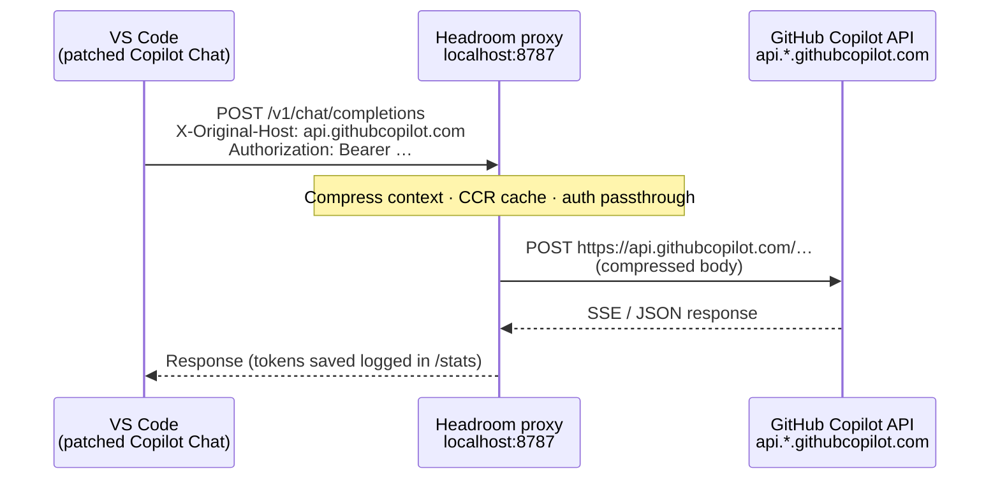

# VS Code Copilot Chat Integration

Route GitHub Copilot Chat traffic through [Headroom](https://github.com/headroomlabs-ai/headroom) for context compression — same Copilot models and subscription, fewer tokens on every chat turn.

This integration spans **three GitHub projects**: upstream Headroom ([`headroomlabs-ai/headroom`](https://github.com/headroomlabs-ai/headroom), formerly `chopratejas/headroom`), the zealgoswami-lab fork that adds this `plugin/` integration ([`zealgoswami-lab/headroom`](https://github.com/zealgoswami-lab/headroom)), and the patched Copilot Chat VSIX ([`damnthonyy/vscode`](https://github.com/damnthonyy/vscode)). See [Upstream Headroom vs zealgoswami-lab fork vs patched VSIX](#upstream-headroom-vs-zealgoswami-lab-fork-vs-patched-vsix) for how they differ.

This integration requires **three pieces working together**:

1. **Headroom proxy** listening on `http://localhost:8787`
2. **Patched GitHub Copilot Chat extension** (bundled `copilot-proxy.vsix`) — stock Copilot Chat does not send the headers Headroom needs
3. **VS Code user settings** that point Copilot Chat at the proxy and prevent the marketplace from reverting the patch

> **Do not use stock VS Code + stock Copilot Chat extension.** Microsoft's built-in extension talks directly to GitHub's API and cannot route through Headroom with compression.

---

## Index

- [Architecture](#architecture)
- [Upstream Headroom vs zealgoswami-lab fork vs patched VSIX](#upstream-headroom-vs-zealgoswami-lab-fork-vs-patched-vsix)
- [Network egress and data flow](#network-egress-and-data-flow)
- [Why this uses a proxy architecture](#why-this-uses-a-proxy-architecture)
- [Prerequisites](#prerequisites)
- [Quick start (3 steps)](#quick-start-3-steps)
- [Install the patched extension](#install-the-patched-extension)
- [VS Code settings explained](#vs-code-settings-explained)
- [Starting the Headroom proxy](#starting-the-headroom-proxy)
- [Enterprise and plan support](#enterprise-and-plan-support)
- [Windows notes](#windows-notes)
- [WSL notes](#wsl-notes)
- [Verification and testing](#verification-and-testing)
- [Troubleshooting](#troubleshooting)
- [Version compatibility](#version-compatibility)
- [Updating the VSIX when VS Code updates](#updating-the-vsix-when-vs-code-updates)
- [Related Headroom integrations](#related-headroom-integrations)
- [MCP vs patched VSIX](#mcp-vs-patched-vsix)
- [License and attribution](#license-and-attribution)

## Architecture

Copilot Chat normally calls `https://api.githubcopilot.com` (or a plan-specific host). The patched extension instead sends OpenAI-compatible requests to Headroom on localhost. Headroom compresses prompts and tool context, then forwards the request upstream. The extension sets `X-Original-Host` so Headroom knows which Copilot API hostname to use — without that header, traffic would hit the wrong upstream or be rejected.



ASCII equivalent:

```
┌─────────────────────┐     http://localhost:8787/v1      ┌──────────────────────┐
│  VS Code            │  + X-Original-Host header         │  Headroom proxy      │
│  patched Copilot    │ ─────────────────────────────────►│  (compress + CCR)    │
│  Chat extension     │                                   └──────────┬───────────┘
└─────────────────────┘                                              │
                                                                     │ https://api.*.githubcopilot.com
                                                                     ▼
                                                          ┌──────────────────────┐
                                                          │  GitHub Copilot API  │
                                                          └──────────────────────┘
```

The `X-Original-Host` allowlist in `headroom/providers/proxy_routes.py` is intentional SSRF hardening (merged in PR #1192). Only these hostnames are accepted:

| Host | Typical use |
|------|-------------|
| `api.githubcopilot.com` | Default (Business / mixed plans) |
| `api.individual.githubcopilot.com` | Individual Copilot subscription |
| `api.business.githubcopilot.com` | GitHub Enterprise Cloud (GHEC) — business SKU |
| `api.enterprise.githubcopilot.com` | GHEC — enterprise SKU |
| `api-model-lab.githubcopilot.com` | Model lab / preview endpoints |

Any other value is logged and ignored — the proxy will not forward to arbitrary hosts.

## Upstream Headroom vs zealgoswami-lab fork vs patched VSIX

People often mix these up. This Copilot integration involves **three separate GitHub projects**, not one monolithic fork:

| Component | GitHub repo | What it is | What it does | What it does not do |
|-----------|-------------|------------|--------------|---------------------|
| **Upstream Headroom** | [`headroomlabs-ai/headroom`](https://github.com/headroomlabs-ai/headroom) (formerly [`chopratejas/headroom`](https://github.com/chopratejas/headroom)) | Canonical Headroom proxy/compression project | Python proxy (`headroom proxy`), CCR compression, MCP server, `headroom wrap` for CLI agents, PyPI releases (`headroom-ai`) | Does not ship a VS Code Copilot Chat plugin or patched VSIX |
| **zealgoswami-lab fork** | [`zealgoswami-lab/headroom`](https://github.com/zealgoswami-lab/headroom) | Personal/org fork of upstream Headroom | Adds the `plugin/` directory (this README, bundled `copilot-proxy.vsix`, VS Code settings), `X-Original-Host` Copilot routing in the proxy, Docker `vscode-plugin-builder`, and Copilot overlay compose files | Not the canonical release channel; diverges from upstream (custom commits ahead, missing upstream fixes behind) |
| **Patched Copilot Chat extension** | [`damnthonyy/vscode`](https://github.com/damnthonyy/vscode) VSIX | Modified Microsoft Copilot Chat extension | Sends Copilot Chat traffic to `http://localhost:8787/v1` and sets `X-Original-Host` for plan-specific upstream routing | Does not compress context or expose `/stats` by itself |

### What zealgoswami-lab fork means

**`zealgoswami-lab/headroom`** is the fork of upstream Headroom that layers the VS Code Copilot Chat integration on top — the `plugin/` directory, bundled VSIX, and Copilot-specific proxy routing documented here. A separate stale personal mirror exists at [`agoswami84/headroom_open_source_model`](https://github.com/agoswami84/headroom_open_source_model); it is not maintained for this workflow.

Upstream Headroom and the zealgoswami-lab fork are both **Headroom proxy codebases** (Python/Rust). The damnthonyy project is a **VS Code extension fork** — a different artifact entirely.

### chopratejas/headroom vs headroomlabs-ai/headroom

[`chopratejas/headroom`](https://github.com/chopratejas/headroom) now resolves to the organization repo [`headroomlabs-ai/headroom`](https://github.com/headroomlabs-ai/headroom). Same project — canonical source, issues, and releases live under `headroomlabs-ai/headroom`. Docs and PyPI still reference `chopratejas` in places (Docker image `ghcr.io/chopratejas/headroom`, HuggingFace models, etc.).

### What to install for this integration

You need **all three pieces**:

1. **Headroom proxy** — run from this repo (`zealgoswami-lab/headroom`) or, once merged upstream, from `headroomlabs-ai/headroom`. The proxy code in the zealgoswami-lab fork includes Copilot-specific `X-Original-Host` routing that stock upstream may not yet ship.
2. **Patched VSIX** — install `plugin/copilot-proxy.vsix` (built from `damnthonyy/vscode`).
3. **VS Code settings** — `github.copilot.chat.proxy.url` and extension auto-update disabled (see [Quick start](#quick-start-3-steps)).

In short:

- **Upstream Headroom = canonical compression engine + observability**
- **zealgoswami-lab fork (`zealgoswami-lab/headroom`) = upstream Headroom + Copilot Chat plugin integration in `plugin/`**
- **damnthonyy VSIX = traffic redirector from VS Code to Headroom**
- Removing the proxy or the patched VSIX breaks automatic per-turn Copilot compression.

For production proxy/compression outside VS Code Copilot Chat, prefer **upstream** [`headroomlabs-ai/headroom`](https://github.com/headroomlabs-ai/headroom) releases. Use this fork when you specifically need the bundled Copilot Chat VSIX workflow documented here.

## Network egress and data flow

Yes, data goes out of your local machine/network in normal Copilot usage.

- **What stays local first:** Copilot request payloads go to local Headroom (`localhost:8787`) where compression and routing happen.
- **What goes upstream:** after compression, Headroom forwards the request to GitHub Copilot API hosts (`api.*.githubcopilot.com`) and receives the model response back.
- **Practical meaning:** Headroom reduces token volume and adds observability, but it is not an offline/local-only Copilot mode.
- **How to keep traffic inside enterprise boundaries:** use your organization's approved Copilot Enterprise/GHE endpoint configuration (`GITHUB_COPILOT_API_URL` / enterprise domain settings) and network controls.

## Why this uses a proxy architecture

This integration uses a local proxy because it is the only reliable way to apply Headroom automatically on every Copilot Chat turn while keeping the normal Copilot UX.

- **Automatic per-turn interception/compression:** every chat request and tool payload passes through Headroom, so compression happens without manual copy/paste or prompt wrappers.
- **Copilot compatibility:** the patched extension keeps Copilot auth/session behavior and streaming response handling, while Headroom forwards requests upstream.
- **Centralized upstream routing:** `X-Original-Host` lets one local endpoint route to the correct plan-specific Copilot host safely.
- **Observability in one place:** `/stats`, proxy logs, and dashboard views show savings and request behavior across all chats.
- **Why not MCP-only or manual tools:** those can assist with workflows, but they do not automatically intercept native Copilot Chat traffic on every turn.

---

## Prerequisites

| Requirement | Notes |
|-------------|-------|
| **VS Code** | Recent stable build (1.9x+). The bundled VSIX targets Copilot Chat **v0.56.0** from the [damnthonyy/vscode](https://github.com/damnthonyy/vscode) fork. |
| **GitHub Copilot subscription** | Individual, Business, or Enterprise Cloud. Sign in via VS Code's Copilot account UI before testing. |
| **Headroom** | `pip install "headroom-ai[proxy]"` or Docker (see below). Python 3.10+. |
| **GitHub CLI** (optional) | `gh auth token` for Docker Copilot overlay auth. |

---

## Quick start (3 steps)

### 1. Start the Headroom proxy

```bash
headroom proxy --port 8787
```

Or with Docker (default compose — starts Qdrant/Neo4j dependencies):

```bash
docker compose up headroom-proxy
```

Verify:

```bash
curl http://localhost:8787/readyz
```

### 2. Install the patched Copilot Chat VSIX

From the repository root:

```bash
code --install-extension ./plugin/copilot-proxy.vsix --force
```

Then reload the window: **Ctrl/Cmd+Shift+P** → **Developer: Reload Window**.

### 3. Configure VS Code settings

Open user `settings.json` (**Ctrl/Cmd+Shift+P** → **Preferences: Open User Settings (JSON)**) and add:

```json
{
  "github.copilot.chat.proxy.url": "http://localhost:8787/v1",
  "extensions.autoUpdate": "off",
  "extensions.autoCheckUpdates": false
}
```

These match [`plugin/vscode-settings.json`](vscode-settings.json) in this repo.

Send a Copilot Chat message. If routing works, proxy logs show requests with `X-Original-Host`, and `curl http://localhost:8787/stats` reports token savings.

---

## Install the patched extension

Three paths — pick one.

### A) Bundled VSIX (recommended)

The repo ships a pre-built package:

```
plugin/copilot-proxy.vsix   (v0.56.0, damnthonyy/vscode fork)
```

```bash
code --install-extension ./plugin/copilot-proxy.vsix --force
```

Use `--force` when reinstalling over an existing Copilot Chat build.

### B) Download from GitHub Releases

Pre-built artifacts may be published at:

**https://github.com/damnthonyy/vscode/releases**

Download the `copilot-proxy.vsix` (or equivalent) asset matching your VS Code / Copilot Chat version, then:

```bash
code --install-extension /path/to/copilot-proxy.vsix --force
```

### C) Build from source (Docker)

The `vscode-plugin-builder` service clones the fork, builds the Copilot extension, and writes `plugin/copilot-proxy.vsix`:

```bash
docker compose --profile plugin run --rm vscode-plugin-builder
code --install-extension ./plugin/copilot-proxy.vsix --force
```

Build args (optional overrides in `.env` or shell):

| Variable | Default |
|----------|---------|
| `VSCODE_FORK_REPO` | `https://github.com/damnthonyy/vscode.git` |
| `VSCODE_FORK_COMMIT` | `bd6c147a19b5934e8008e8e1b518383b2de90218` |

Pin updates deliberately — the Dockerfile documents supply-chain expectations. When bumping the commit, note the audit in your PR.

---

## VS Code settings explained

```json
{
  "github.copilot.chat.proxy.url": "http://localhost:8787/v1",
  "extensions.autoUpdate": "off",
  "extensions.autoCheckUpdates": false
}
```

| Setting | Purpose |
|---------|---------|
| `github.copilot.chat.proxy.url` | Tells the **patched** Copilot Chat extension to send LLM API traffic to Headroom instead of GitHub directly. Must include the `/v1` prefix. |
| `extensions.autoUpdate` | **Must be `"off"`.** VS Code auto-update will replace the patched VSIX with Microsoft's stock Copilot Chat from the marketplace, breaking Headroom routing. |
| `extensions.autoCheckUpdates` | Disables update nags that tempt re-enabling auto-update. Keep both extension settings off for the life of this integration. |

If you use workspace settings, apply the same keys there or ensure user settings are not overridden.

---

## Starting the Headroom proxy

### pip (local development)

```bash
pip install "headroom-ai[proxy]"
headroom proxy --port 8787
```

Optional dashboard: `headroom dashboard` (proxy must be running).

The patched VS Code extension forwards the Copilot session `Authorization` header from your VS Code sign-in. For quota tracking and fallback auth, you can also export:

```bash
export GITHUB_TOKEN=$(gh auth token)   # optional but recommended
headroom proxy --port 8787
```

### Docker — default compose

```bash
docker compose up headroom-proxy
```

Binds `8787:8787`, runs health checks against `/readyz`, persists workspace data in the `headroom_workspace` volume.

### Docker — Copilot overlay

Use [`docker-compose.copilot.yml`](../docker-compose.copilot.yml) when you want the container's OpenAI-compatible upstream pinned to GitHub Copilot:

```bash
export GITHUB_TOKEN=$(gh auth token)
docker compose -f docker-compose.yml -f docker-compose.copilot.yml up headroom-proxy
```

The overlay sets:

- `OPENAI_TARGET_API_URL=https://api.githubcopilot.com`
- `GITHUB_TOKEN=${GITHUB_TOKEN}`

Pair this with the VS Code settings above. `GITHUB_TOKEN` should be a token with Copilot access ( `gh auth token` after `gh auth login` is the usual path).

---

## Enterprise and plan support

| Deployment | Supported via this integration | Notes |
|------------|-------------------------------|-------|
| **GitHub.com — Individual** | Yes | Extension sends `X-Original-Host: api.individual.githubcopilot.com` when applicable. |
| **GitHub.com — Business / Pro+** | Yes | Default `api.githubcopilot.com`. |
| **GHEC** (GitHub Enterprise Cloud) | Yes | `api.business.githubcopilot.com` or `api.enterprise.githubcopilot.com` via `X-Original-Host`. Sign in with your enterprise account in VS Code. |
| **GHES** (GitHub Enterprise Server, self-hosted) | Yes | Extension sends `X-Original-Host: copilot-api.<tenant>.ghe.com` (hosted GHES) or `copilot-api.<your-domain>` for custom domains. Set `GITHUB_COPILOT_ENTERPRISE_DOMAIN=<your-domain>` (or `GITHUB_COPILOT_API_URL=https://copilot-api.<your-domain>`) on the proxy so custom hostnames are trusted. |

Headroom's separate `headroom wrap copilot --subscription` path (Copilot CLI) uses the same enterprise env vars (`GITHUB_COPILOT_ENTERPRISE_DOMAIN`, `GITHUB_COPILOT_API_URL`).

---

## Windows notes

- **No TLS MITM required.** The extension talks plain HTTP to `localhost:8787`. You do not need a corporate root CA, Fiddler, or mitmproxy — unlike approaches that intercept HTTPS to `api.githubcopilot.com`.
- **Install from a terminal** where `code` is on PATH (VS Code's "Shell Command: Install 'code' command in PATH" from the Command Palette).
  ```powershell
  code --install-extension .\plugin\copilot-proxy.vsix --force
  ```
- **Reload the window** after every VSIX install or upgrade.
- **Firewall:** allow local loopback to port `8787`. Remote machines cannot reach `localhost` — run the proxy on the same host as VS Code (or use explicit port forwarding).
- **Auto-update:** confirm `extensions.autoUpdate` is off in **User** settings, not only Workspace — marketplace updates have reverted patched installs in the field.

---

## WSL notes

| Setup | Guidance |
|-------|----------|
| **VS Code on Windows, proxy in WSL** | Use `http://localhost:8787/v1` — recent WSL2 forwards Windows `localhost` to WSL services. If connection refused, start the proxy bound to `0.0.0.0` or run `netsh interface portproxy` / use the WSL VM IP. |
| **VS Code Remote — WSL** | Install the VSIX inside the WSL remote extension host: open the repo in WSL, run `code --install-extension ./plugin/copilot-proxy.vsix --force` from the WSL terminal. Settings go in the **Remote** user settings tab when prompted. |
| **Proxy only on Windows, VS Code in WSL** | Point `github.copilot.chat.proxy.url` at `http://host.docker.internal:8787/v1` or the Windows host IP instead of `localhost`. |

Rule of thumb: the hostname in `github.copilot.chat.proxy.url` must resolve to wherever `headroom proxy` is actually listening.

---

## Verification and testing

### Verify the patched extension is installed

Before running end-to-end tests, confirm VS Code is running the patched VSIX — not Microsoft's stock or built-in Copilot Chat from the marketplace.

#### 1. CLI check

List installed extensions and filter for Copilot:

**bash / macOS / Linux / WSL:**

```bash
code --list-extensions --show-versions | grep -i copilot
```

**Windows PowerShell:**

```powershell
code --list-extensions --show-versions | findstr /i copilot
```

**Expected output** — Copilot Chat from the VSIX install, at or above the bundled version:

```
github.copilot-chat@0.56.0
```

The exact patch version may be `0.56.x` or newer if you installed a release built against a later VS Code. What matters:

- Extension ID is `github.copilot-chat` (case-insensitive in CLI output).
- Version reflects your **VSIX install**, not a silently auto-updated marketplace build.
- If the listed version is **newer** than your bundled `copilot-proxy.vsix` but you installed with `--force`, you may still be on stock — cross-check with the UI steps below.

#### 2. VS Code UI check

1. Open the Extensions sidebar: **Ctrl+Shift+X** (Windows/Linux) or **Cmd+Shift+X** (macOS).
2. Search for **Copilot Chat**.
3. Confirm:
   - **Extension ID:** `GitHub.copilot-chat`
   - **Version:** `0.56.x` (or the version printed on your VSIX) from a local VSIX install
   - **Source:** installed from VSIX — not "Auto-updated" or freshly pulled from the Marketplace

If VS Code shows a newer marketplace version and offers to update, **do not update** — that replaces the patch. Ensure `extensions.autoUpdate` is off (see below).

#### 3. Settings check

Open user `settings.json` (**Ctrl/Cmd+Shift+P** → **Preferences: Open User Settings (JSON)**) and confirm:

```json
{
  "github.copilot.chat.proxy.url": "http://localhost:8787/v1",
  "extensions.autoUpdate": "off",
  "extensions.autoCheckUpdates": false
}
```

| Check | Why |
|-------|-----|
| `github.copilot.chat.proxy.url` is set | Only the patched extension reads this key; stock Copilot Chat ignores it. |
| `extensions.autoUpdate` is `"off"` | Marketplace auto-update reverts the VSIX to Microsoft's build. |
| `extensions.autoCheckUpdates` is `false` | Reduces prompts to re-enable updates. |

Apply these in **User** settings (not only Workspace) on Windows — workspace-only settings have reverted patched installs in the field.

#### 4. Version downgrade error

If `code --install-extension` fails with **"cannot be downgraded"** (or similar), VS Code already has a **newer** built-in or marketplace Copilot Chat than your VSIX:

1. Note the installed version from the CLI or Extensions UI.
2. Obtain a **newer patched VSIX** from [damnthonyy/vscode releases](https://github.com/damnthonyy/vscode/releases) or rebuild with `docker compose --profile plugin run --rm vscode-plugin-builder` after bumping `VSCODE_FORK_COMMIT`.
3. Reinstall:
   ```bash
   code --install-extension ./plugin/copilot-proxy.vsix --force
   ```
   **Windows PowerShell:**
   ```powershell
   code --install-extension .\plugin\copilot-proxy.vsix --force
   ```
4. If VS Code still refuses, uninstall Copilot Chat from the Extensions UI, then install the VSIX again.
5. **Developer: Reload Window** and re-run the CLI check.

The patched VSIX must be **≥ the Copilot Chat version VS Code ships built-in** for your VS Code build — see [Version compatibility](#version-compatibility).

#### 5. Quick functional test

With the Headroom proxy running:

```bash
headroom proxy --port 8787
```

1. Sign into GitHub Copilot in VS Code if you have not already.
2. Open Copilot Chat and send any message (e.g. "ping").
3. Watch proxy stdout. With debug logging:
   ```bash
   HEADROOM_LOG_LEVEL=DEBUG headroom proxy --port 8787
   ```
   **Windows PowerShell:**
   ```powershell
   $env:HEADROOM_LOG_LEVEL = "DEBUG"
   headroom proxy --port 8787
   ```
4. **Success:** logs show a forwarded request with `X-Original-Host` set to an allowed `api.*.githubcopilot.com` host, and no `Rejected X-Original-Host` warning.
5. **Failure:** chat works but proxy logs stay empty — you are likely on stock Copilot Chat; repeat the CLI and UI checks above.

Optional confirmation of compression:

```bash
curl -s http://localhost:8787/stats | jq '.savings // .'
```

---

### 1. Quick check: is traffic going through Headroom?

When you send a Copilot Chat message (or use another client like Cursor configured to `http://localhost:8787`), traffic is going through Headroom if **all** of the following are true:

- Proxy is running on `http://localhost:8787` (for example `headroom proxy --port 8787`).
- `curl http://localhost:8787/readyz` returns HTTP 200 with `"ready": true`.
- While you chat, the proxy terminal shows requests with `X-Original-Host` (for Copilot) or your provider host, and **not** just health checks.
- `curl http://localhost:8787/stats` shows non-zero `savings` after a few requests.

If your chat still works but proxy logs stay empty, the client is likely talking directly to the upstream provider instead of Headroom (routing misconfigured).

### 2. Proxy health

```bash
curl -s http://localhost:8787/readyz | jq .
```

Expect HTTP 200 and `"ready": true`. Docker health checks use the same endpoint.

Expected output (trimmed):

```json
{
  "service": "headroom-proxy",
  "status": "ok",
  "ready": true,
  "timestamp": "<ISO-8601 timestamp>",
  "uptime_seconds": <number>,
  "version": "<semver>",
  "checks": {
    "upstream": {
      "status": "ok",
      "url": "https://api.githubcopilot.com"
    }
  }
}
```

Verify these fields:

- `service` is present (for example `headroom-proxy`)
- `ready` is `true`
- `status` is `ok`
- `checks.upstream.status` is `ok`
- `checks.upstream.url` matches your Copilot host

Values like `timestamp`, `uptime_seconds`, and runtime counters vary by environment and request timing.

For Copilot users, `checks.upstream.url` should point to a Copilot host (for example `api.individual.githubcopilot.com`, `api.business.githubcopilot.com`, or `api.enterprise.githubcopilot.com`) — not `api.anthropic.com`.

If the upstream URL is wrong, restart the proxy with `OPENAI_TARGET_API_URL` set to your Copilot endpoint.

### 3. Copilot Chat end-to-end

1. Confirm you are signed into GitHub Copilot in VS Code (account menu).
2. Open Copilot Chat, send a message that pulls repo context (e.g. "Summarize this project").
3. Watch proxy stdout for forwarded requests. With debug logging:
   ```bash
   HEADROOM_LOG_LEVEL=DEBUG headroom proxy --port 8787
   ```
   Look for upstream routing to `https://api.*.githubcopilot.com` and no `Rejected X-Original-Host` warnings.

### 4. Token savings

```bash
curl -s http://localhost:8787/stats | jq '.savings // .'
```

Or run `headroom dashboard` in another terminal.

No extra per-user command is required once the proxy is running and traffic is routed through it. Any dashboard/client can read these directly from `/stats`:

```bash
curl -s http://localhost:8787/stats | jq '.compression_summary'
```

For a compact headline view:

```bash
curl -s http://localhost:8787/stats | jq '.compression_summary | {proxy, cli_filtering, all_layers}'
```

### `compression_summary` (preferred)

| Block | Key fields | Meaning |
|-------|------------|---------|
| **`proxy`** | `received_tokens`, `forwarded_tokens`, `tokens_saved`, `savings_percent_of_received` | Proxy HTTP-path compression only. `received_tokens` = pre-compression request input; `forwarded_tokens` = tokens sent upstream after compression. |
| **`proxy`** | `attempted_tokens`, `active_savings_percent_of_attempted` | Compressible-only denominator (excludes prefix-frozen content). Answers “how well did we compress what we tried to compress?” |
| **`cli_filtering`** | `tokens_saved`, `tool`, `label` | Tokens avoided by RTK / lean-ctx before requests reach the proxy. Not included in `proxy.received_tokens`. |
| **`all_layers`** | `received_tokens`, `forwarded_tokens`, `tokens_saved`, `savings_percent_of_received` | Combined proxy + CLI filtering. `received_tokens = forwarded_tokens + proxy.tokens_saved + cli_filtering.tokens_saved`. |
| **`display_session`** | `received_tokens`, `forwarded_tokens`, `tokens_saved`, `savings_percent_of_received` | Persisted proxy-compression session (rollover after inactivity). Proxy-layer only. |

### `tokens` (backward-compatible aliases)

```bash
curl -s http://localhost:8787/stats | jq '.tokens | {proxy_received_tokens, proxy_forwarded_tokens, proxy_tokens_saved, all_layers_received_tokens, all_layers_tokens_saved, total_saved_percent}'
```

| Field | Scope | Meaning |
|-------|-------|---------|
| `received_tokens` | proxy | Alias of `proxy_received_tokens` — before proxy compression |
| `forwarded_tokens` / `compressed_tokens` | proxy | Tokens forwarded upstream after proxy compression |
| `proxy_tokens_saved` | proxy | Tokens removed by proxy compression |
| `all_layers_received_tokens` | all layers | Counterfactual input before any Headroom reduction |
| `all_layers_tokens_saved` / `total_saved_tokens` | all layers | Proxy compression + CLI filtering |
| `total_saved_percent` | all layers | `all_layers_tokens_saved / all_layers_received_tokens * 100` |
| `input` | proxy | Legacy alias of `forwarded_tokens` (post-compression input total) |

Legacy fields (`saved`, `proxy_compression_saved`, `savings_percent`) remain unchanged for older dashboards.

### 5. Manual header check (optional)

If you need to confirm allowlist behavior without VS Code:

```bash
curl -s -X POST http://localhost:8787/v1/chat/completions \
  -H "Content-Type: application/json" \
  -H "X-Original-Host: api.githubcopilot.com" \
  -H "Authorization: Bearer YOUR_COPILOT_TOKEN" \
  -d '{"model":"gpt-4o","messages":[{"role":"user","content":"ping"}]}'
```

A `401` with routing metadata still proves the proxy accepted `X-Original-Host`; a `200` proves full auth. Use a real Copilot session token from your environment — do not commit tokens.

---

## Troubleshooting

| Symptom | Likely cause | Fix |
|---------|--------------|-----|
| Copilot works but **no compression** / stats stay zero | Stock Copilot extension installed | Reinstall `copilot-proxy.vsix` with `--force`; verify extension ID shows the fork build. Disable auto-update. |
| **`Connection refused`** on chat | Proxy not running or wrong port | Start `headroom proxy --port 8787` or Docker compose; match port in settings. |
| **`Rejected X-Original-Host`** in proxy logs | Wrong extension build or unconfigured GHES domain | Reinstall patched VSIX; for custom GHES domains set `GITHUB_COPILOT_ENTERPRISE_DOMAIN` on the proxy (see enterprise table). |
| **401 / 403 from Copilot** | Expired sign-in or missing token | Sign out/in of Copilot in VS Code; for Docker, set `GITHUB_TOKEN=$(gh auth token)`. |
| **Extension version downgrade blocked** | VSIX older than installed Copilot Chat | Use `--force`; if VS Code refuses, uninstall Copilot Chat first, then install the VSIX. |
| **Extension reverted after VS Code restart** | `extensions.autoUpdate` re-enabled | Set both `extensions.autoUpdate` and `extensions.autoCheckUpdates` to off; reload window. |
| **Chat works on host, fails in WSL** | `localhost` mismatch | See WSL notes — align proxy host with VS Code's network namespace. |
| **Copilot quota / plan errors** | Business vs individual endpoint | Ensure enterprise sign-in; check logs for which `api.*.githubcopilot.com` host was selected. |

---

## Version compatibility

| Component | Version in this repo |
|-----------|---------------------|
| Bundled VSIX | **v0.56.0** (`plugin/copilot-proxy.vsix`) |
| Fork source | [damnthonyy/vscode](https://github.com/damnthonyy/vscode) @ `bd6c147a…` (default Docker build) |
| VS Code built-in Copilot Chat | Often **newer** than v0.56.0 — Microsoft's marketplace moves independently |

The patched VSIX is a **pinned fork** of GitHub Copilot Chat, not the live marketplace version. It is normal for its version number to lag or differ from what VS Code ships built-in. That is expected — you install it as a replacement, not alongside stock Copilot Chat.

**Compatibility rule:** the VSIX major/minor should match the Copilot Chat API surface your VS Code build expects. If VS Code upgrades and chat breaks (missing features, install errors, silent fallback to direct API), rebuild or download a newer VSIX from the fork.

---

## Updating the VSIX when VS Code updates

1. Check [damnthonyy/vscode releases](https://github.com/damnthonyy/vscode/releases) for a VSIX built against your VS Code version.
2. Or rebuild locally:
   ```bash
   # Optionally bump VSCODE_FORK_COMMIT in docker-compose.yml / .env
   docker compose --profile plugin run --rm vscode-plugin-builder
   ```
3. Reinstall:
   ```bash
   code --install-extension ./plugin/copilot-proxy.vsix --force
   ```
4. **Developer: Reload Window**
5. Re-verify `extensions.autoUpdate` is still off.

After upstream Copilot Chat changes, the fork maintainer may need to merge Microsoft's updates before a new VSIX is available — plan for a short gap after major VS Code releases.

---

## Related Headroom integrations

| Tool | Integration |
|------|-------------|
| **Copilot CLI** | `headroom wrap copilot` / `headroom wrap copilot --subscription` — no VSIX required |
| **Cursor** | Set OpenAI base URL to `http://localhost:8787` |
| **Claude Code** | `headroom wrap claude` |

See the [main README](../README.md) and [proxy docs](../wiki/proxy.md) for the full agent matrix.

---

## MCP vs patched VSIX

The Headroom MCP server and the patched Copilot Chat VSIX operate at **different layers**. One does not replace the other — and MCP cannot substitute for the VSIX when your goal is automatic Copilot Chat compression.

| Layer | Patched VSIX + proxy | Headroom MCP |
|-------|---------------------|--------------|
| **Transport** | HTTP — OpenAI-compatible LLM API | stdio — Model Context Protocol tools |
| **What it affects** | Every Copilot Chat LLM request | On-demand tool calls from MCP-capable agents |
| **Automatic compression** | Yes — proxy compresses each turn | No — only when an agent invokes tools |
| **CCR retrieve / stats** | Proxy `/stats`, logs, dashboard | `headroom_retrieve`, `headroom_stats` tools |

**The patched VSIX cannot be converted or replaced by an MCP server.** Copilot Chat sends chat completions over HTTP to GitHub (or, with the fork, to Headroom's proxy). MCP runs as a subprocess and exposes tools (`headroom_compress`, `headroom_retrieve`, `headroom_stats`) to hosts that speak the protocol. There is no path for MCP to intercept or proxy Copilot Chat's LLM traffic.

**MCP does not intercept Copilot Chat LLM traffic.** Installing only the Headroom MCP server leaves Copilot Chat on stock routing — you gain optional tools, not per-turn compression.

### Recommended hybrid setup

For VS Code Copilot Chat, keep the [Quick start](#quick-start-3-steps) stack:

1. **Headroom proxy** — compression and CCR on every LLM request
2. **Patched VSIX** — routes Copilot Chat through the proxy with `X-Original-Host`
3. **VS Code settings** — `github.copilot.chat.proxy.url` and extension auto-update disabled

**Optionally** add Headroom MCP in VS Code when you want agents to call `headroom_retrieve` or `headroom_stats` explicitly (e.g. pull full cached context or savings from chat) without leaving the editor. The proxy must still run for MCP tools that depend on `--proxy-url`.

### VS Code MCP configuration

`headroom mcp install` auto-configures **Claude Code, Codex, and OpenCode only** — it does **not** write VS Code's MCP config. Add Headroom manually to user or workspace `mcp.json`:

```json
{
  "servers": {
    "headroom": {
      "type": "stdio",
      "command": "headroom",
      "args": ["mcp", "serve", "--proxy-url", "http://127.0.0.1:8787"]
    }
  }
}
```

Start the proxy on the same host/port before using MCP tools. Tool calls use the proxy for compress/retrieve/stats; they do not route Copilot Chat LLM requests — that remains the VSIX + `github.copilot.chat.proxy.url` path.

---

## License and attribution

- **Upstream Headroom** — [Apache 2.0](../LICENSE), canonical repo [`headroomlabs-ai/headroom`](https://github.com/headroomlabs-ai/headroom) (formerly `chopratejas/headroom`).
- **zealgoswami-lab fork** — same Apache 2.0 license as upstream; Copilot Chat integration commits live in [`zealgoswami-lab/headroom`](https://github.com/zealgoswami-lab/headroom) until contributed upstream.
- **Patched Copilot Chat extension** — derived from Microsoft's GitHub Copilot Chat extension, modified in the [damnthonyy/vscode](https://github.com/damnthonyy/vscode) fork to support `github.copilot.chat.proxy.url` routing and `X-Original-Host` forwarding. This is third-party software, not published by Microsoft or GitHub. Review the fork's license terms before use in regulated environments.

When reporting issues, distinguish:

| Symptom area | Where to file |
|--------------|---------------|
| Compression, `/stats`, general proxy (upstream behavior) | [headroomlabs-ai/headroom](https://github.com/headroomlabs-ai/headroom) |
| Copilot Chat plugin docs, bundled VSIX, `plugin/` integration | [zealgoswami-lab/headroom](https://github.com/zealgoswami-lab/headroom) |
| VSIX build, extension routing, `github.copilot.chat.proxy.url` | [damnthonyy/vscode](https://github.com/damnthonyy/vscode) |
